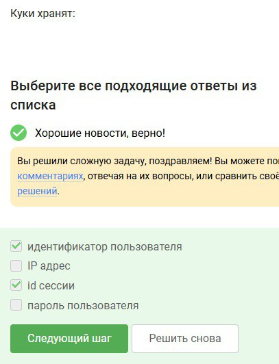
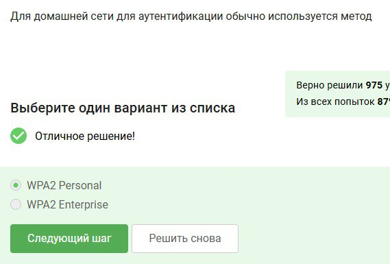

---
## Front matter
lang: ru-RU
title: Первый этап внешнего курса
subtitle: Основы информационной безопасности 
author:
  - Казазаев Д. М.
institute:
  - Российский университет дружбы народов, Москва, Россия

## i18n babel
babel-lang: russian
babel-otherlangs: english

## Formatting pdf
toc: false
toc-title: Содержание
slide_level: 2
aspectratio: 169
section-titles: true
theme: metropolis
header-includes:
 - \metroset{progressbar=frametitle,sectionpage=progressbar,numbering=fraction}
 - '\makeatletter'
 - '\beamer@ignorenonframefalse'
 - '\makeatother'
---

# Информация

## Докладчик

:::::::::::::: {.columns align=center}
::: {.column width="70%"}

  * Казазаев Даниил Михайлович
  * Студент бакалавриата
  * Российский университет дружбы народов
  * [1132231427@rudn.ru]
  * <https://github.com/KazazaevDaniil/study_2024-2025_infosec-intro>

:::
::: {.column width="30%"}

:::
::::::::::::::

# Вводная часть

## Материалы и методы

Внешний кур состоит из трех этапов.

## Этап первый

Первый этап курса состоит из 4 частей:

1. Базовые сетевые протоколы
2. Персонализация сети
3. Браузер TOR
4. Беспроводные сети Wi-fi
 
# Выполнение первого этапа внешнего курса.

# Базовые сетевые протоколы

## Базовые сетевые протоколы

HTTPS является протоколом прикладного уровня. (рис. 1])

{width=50%}

## Базовые сетевые протоколы

Протокол TCP работает на транспортном уровне. (рис. 2)

{width=50%}

## Базовые сетевые протоколы

Адреса формата IPv4 состоят из 4-х значений от 0 до 255. (рис. 3)

{width=50%}

## Базовые сетевые протоколы

DNS сервера необходимы для сопоставления IP адреса с доменным именем при маршрутизации запроса. (рис. 4)

{width=50%}

## Базовые сетевые протоколы

Корректная последовательность протоколов в модели TCP/IP. (рис. 5)

{width=50%}

## Базовые сетевые протоколы

Так как http это незащищенный протокол, он предполагает передачу данных в открытом виде.(рис. 6)

{width=50%}

## Базовые сетевые протоколы

HTTPS протокол состоит из двух фаз: рукопожатия и передачи данных.(рис. 7)

{width=50%}

## Базовые сетевые протоколы

Версия протокола TLS определяется как клиентом, так и сервером на стадии "переговоров".(рис. 8)

{width=50%}

## Базовые сетевые протоколы

На фазе рукопожатия протокола TLS не предусмотрено шифрование данных.(рис. 9)

{width=50%}

# Персонализация сети

## Персонализация сети

Куки-файлы хранят в себе информацию о идентификаторе пользователя и id сессии.(рис. 10)

{width=50%}

## Персонализация сети

Куки-файлы не используются для улучшения надежности соединения. (рис. 11)

{width=50%}

## Персонализация сети

Куки-файлы генерируются сервером. (рис. 12)

{width=50%}

## Персонализация сети

Сессионные куки хранятся в браузере на время пользования им. (рис. [13)

{width=50%}

# Браузер TOR

## Браузер TOR

В браузере на основе TOR три промежуточных узла: охранный, промежуточный, выходной. (рис. 14)

{width=50%}

## Браузер TOR

IP-адрес получателя в системе TOR изместен только отправителю и выходному узлу. (рис. 15)

{width=50%}

## Браузер TOR

При запросе через TOR отправитель гененирует общий секрутный ключ со всеми узлами. (рис. 16)

{width=50%}

## Браузер TOR

Получатель может использовать любой браузер для принятия запроса из TOR. (рис. 17)

{width=50%}

# Беспроводные сети Wi-fi

## Беспроводные сети Wi-fi

Wf-fi - это ... (рис. 18)

{width=50%}

## Беспроводные сети Wi-fi

Протоколы Wf-fi работают на канальном уровне. (рис. 19)

{width=50%}

## Беспроводные сети Wi-fi

Самой небезопасный метод шифрования и аунтификации Wf-fi это WEP, так как он старый и в нем используется малое кольчество бит для шифрования. (рис. 20)

{width=50%}

## Беспроводные сети Wi-fi

Данные шифруются после аунтификации польователя. (рис. 21)

{width=50%}

## Беспроводные сети Wi-fi

Для домашних сетей используется аунтификатор Wi-fi Personal. (рис. 22)

{width=50%}

# Вывод

Выполнен первый этап внешнего курса

