---
## Front matter
lang: ru-RU
title: Второй этап внешнего курса
subtitle: Основы информационной безопасности 
author:
  - Казазаев Д. М.
institute:
  - Российский университет дружбы народов, Москва, Россия

## i18n babel
babel-lang: russian
babel-otherlangs: english

## Formatting pdf
toc: false
toc-title: Содержание
slide_level: 2
aspectratio: 169
section-titles: true
theme: metropolis
header-includes:
 - \metroset{progressbar=frametitle,sectionpage=progressbar,numbering=fraction}
 - '\makeatletter'
 - '\beamer@ignorenonframefalse'
 - '\makeatother'
---

# Информация

## Докладчик

:::::::::::::: {.columns align=center}
::: {.column width="70%"}

  * Казазаев Даниил Михайлович
  * Студент бакалавриата
  * Российский университет дружбы народов
  * [1132231427@rudn.ru]
  * <https://github.com/KazazaevDaniil/study_2024-2025_infosec-intro>

:::
::: {.column width="30%"}

:::
::::::::::::::

# Вводная часть

## Материалы и методы

Внешний кур состоит из трех этапов.

## Этап второй

Первый этап курса состоит из 5 частей:

1. Шифрование диска
2. Пароли
3. Фишинг
4. Вирусы
5. Безопасность мессенджеров
 
# Выполнение второго этапа внешнего курса.

# Шифрование диска

## Шифрование диска

Загрузочный сектор диска можно зашифровать. (рис. 1)

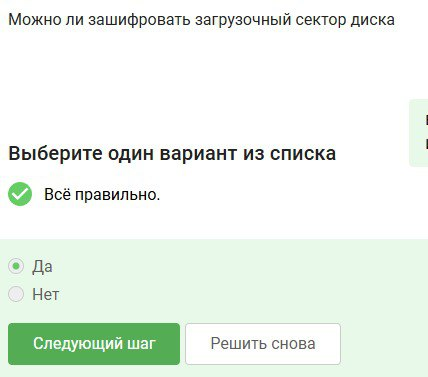{width=40%}

## Шифрование диска

Симметричное шифрование - основа шифрования диска. (рис. 2)

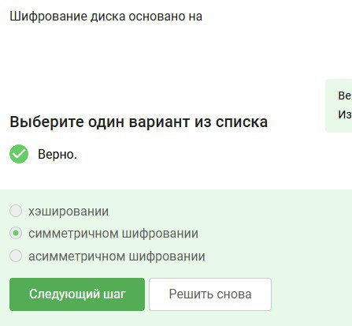{width=40%}

## Шифрование диска

BitLocker - шифратор ОС Windwos, VeraCrypt - утилита для шифрования. (рис. 3)

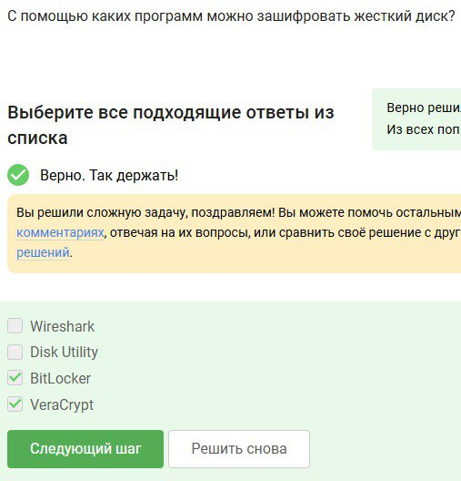{width=40%}

# Пароли

## Пароли

Хороший пароль тот, который является нестандартым и его сложно подобрать. (рис. 4)

{width=40%}

## Пароли

Лучше всего хранить пароли в менеджерах паролей, так как они обеспечены большей степенью защиты. (рис. 5)

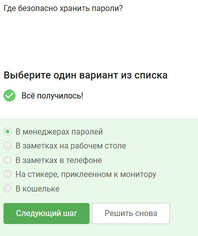{width=40%}

## Пароли

Капчк нужна для предотвращения автоматизированных атак, которые могут подобрать пароль автоматически.(рис. 6)

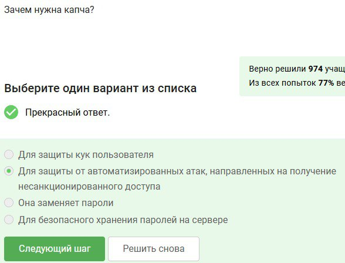{width=40%}

## Пароли

Хеширование необхлодимо, чтобы защитить пароль, а не хранить его на сервере в открытом виде.(рис. 7)

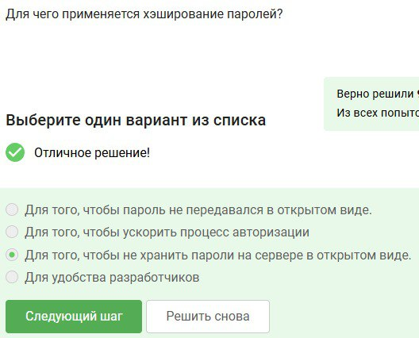{width=40%}

## Пароли

Если злоумышленник получил доступ к серверу, метот соли не поможет от перебора паролей.(рис. 8)

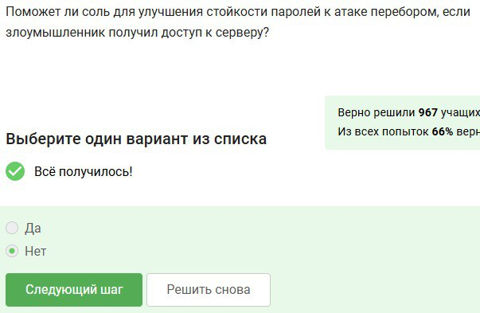{width=40%}

## Пароли

Все перечисленные методы хороши для защиты пароля.(рис. 9)

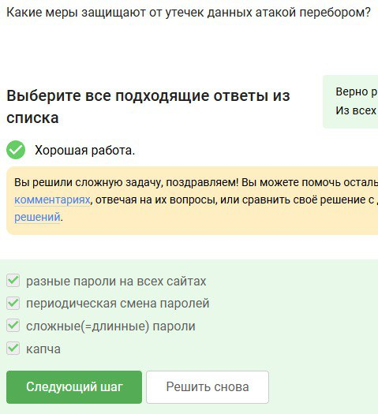{width=40%}

# Фишинг

## Фишинг

Фишинговыми ссылками являются те, у которых домене есть непонятные симфолы или слова.(рис. 10)

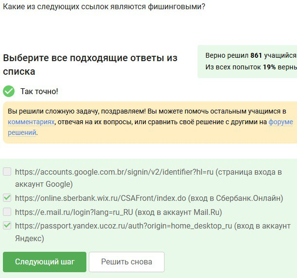{width=40%}

## Фишинг

Фишинговая ссылка может прийти от знакомого пользователя, так как сущетсвует метод Спуфинга, когда злоумышленник подделывает адрес. (рис. 11)

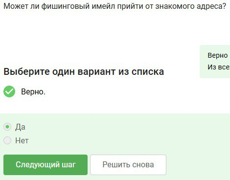{width=40%}

# Вирусы

## Вирусы

Спуфинг - подмена адреса отправителя. (рис. 12)

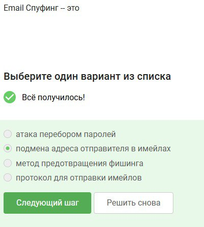{width=40%}

## Вирусы

Вирус Троян - вирус, который маскеруется под обычный файл, но внутри у него вредоносный код. (рис. 13)

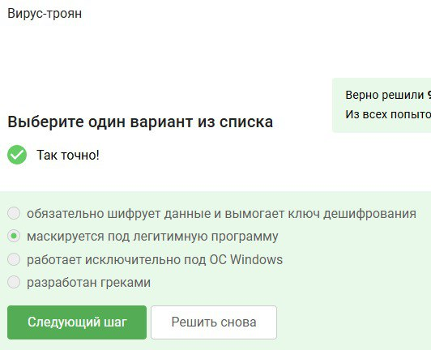{width=40%}

# Безопасность мессенджерей

## Безопасность мессенджерей

Ключ шифрования Signal формируется на этапе генерации сообщения со стороны-отправителя. (рис. 14)

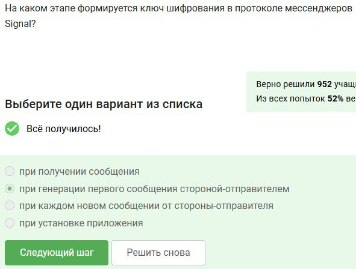{width=40%}

## Безопасность мессенджерей

Суть сквозного шифрования в передачи сообщения по ущлам связи в зашифрованном виде. (рис. 15)

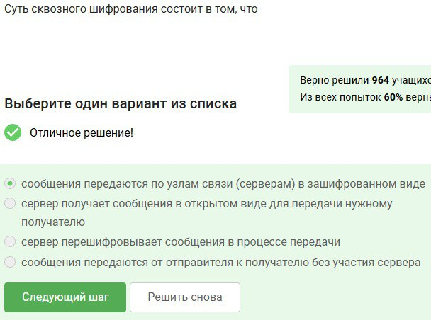{width=40%}

# Вывод

Выполнен второй этап внешнего курса

