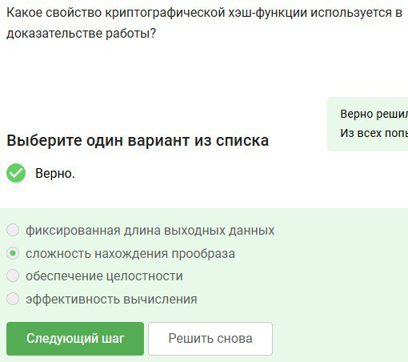

---
## Front matter
lang: ru-RU
title: Третий этап внешнего курса
subtitle: Основы информационной безопасности 
author:
  - Казазаев Д. М.
institute:
  - Российский университет дружбы народов, Москва, Россия

## i18n babel
babel-lang: russian
babel-otherlangs: english

## Formatting pdf
toc: false
toc-title: Содержание
slide_level: 2
aspectratio: 169
section-titles: true
theme: metropolis
header-includes:
 - \metroset{progressbar=frametitle,sectionpage=progressbar,numbering=fraction}
 - '\makeatletter'
 - '\beamer@ignorenonframefalse'
 - '\makeatother'
---

# Информация

## Докладчик

:::::::::::::: {.columns align=center}
::: {.column width="70%"}

  * Казазаев Даниил Михайлович
  * Студент бакалавриата
  * Российский университет дружбы народов
  * [1132231427@rudn.ru]
  * <https://github.com/KazazaevDaniil/study_2024-2025_infosec-intro>

:::
::: {.column width="30%"}

:::
::::::::::::::

# Вводная часть

## Материалы и методы

Внешний кур состоит из трех этапов.

## Этап второй

Первый этап курса состоит из 4 частей:

1. Введине в криптографию
2. Цифровая подпись
3. Электронные платежи
4. Блокчейн
 
# Выполнение третьего этапа внешнего курса.

# Введине в криптографиюВведине в криптографию

## Введине в криптографиюВведине в криптографию

В ассиметричных криптографических примитивах обестороны имеют пару ключей. (рис. 1)

{width=40%}

## Введине в криптографиюВведине в криптографию

Хещ-функция стойкая к колизиям, дает определенное кол-во бит вне зависимости от объема входных данных и эффективно вычисляется. (рис. 2)

{width=40%}

## Введине в криптографиюВведине в криптографию

RSA, ECDSA и ГОСТ стандарт(кузнечик) - алгоритмы цифровой подписи. (рис. 3)

{width=40%}

## Введине в криптографиюВведине в криптографию

Код аунтификации сообщения отеосится к симмитричным примитивам. (рис. 4)

{width=40%}

## Введине в криптографиюВведине в криптографию

Обмен ключами Диффи-Хэллмана - ассиметрический примитив генерации обзего секретного ключа. (рис. 5)

{width=40%}

# Цифровая подпись

## Цифровая подпись

Протоколы цифровой подписи с публичным ключом.(рис. 6)

{width=40%}

## Цифровая подпись

Алгоритм верификации требует на вход: подпись, открытый ключ, сообщение.(рис. 7)

{width=40%}

## Цифровая подпись

Электронная подпись не обеспечивает конфиденциальность.(рис. 8)

{width=40%}

## Цифровая подпись

Для отправки налоговой отчетности необходим сертификат с усилненной квалификацией.(рис. 9)

{width=40%}

## Цифровая подпись

Квалифицированный сертификат можно получить в удостоверяющем центре.(рис. 10)

{width=40%}

# Электронные платежи

## Электронные платежи

МИР, MasterCard - платежные системы. (рис. 11)

{width=40%}

## Электронные платежи

Отмеченные варианты ответов являются примером многофакторной аутентификации. (рис. 12)

{width=40%}

## Электронные платежи

Сегодня при онлайн платежах используется многофакторная аутентификация покупателя перед банком-эмитентом. (рис. 13)

{width=40%}

# Блокчейн

## Блокчейн

В доказательстве работы криптографической хеш-функции используется сложность нахождения прообраза. (рис. 14)

{width=40%}

# Блокчейн

Все ответы являются верными для консенсуса некоторых блокчейн систем. (рис. 15)

{width=40%}

# Блокчейн

Участники криптографического примитива хранят при себе только цифровую подпись. (рис. 16)

{width=40%}

# Вывод

Выполнен третий этап внешнего курса
