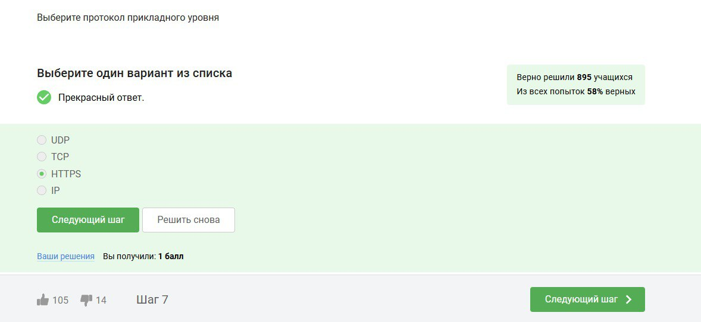
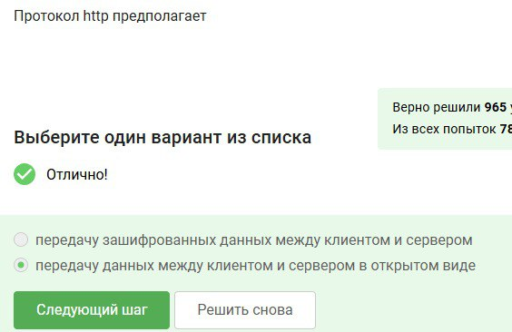
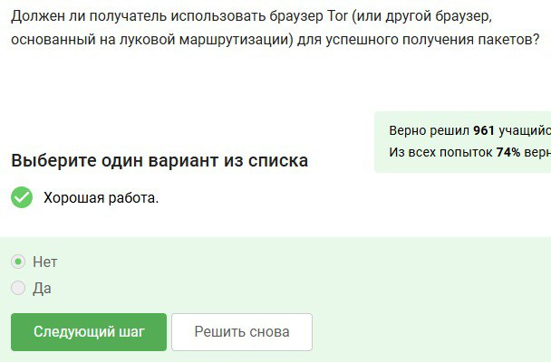

---
## Front matter
title: "Отчет по первому этапу внешнего курса"
subtitle: "Дисциплина: основы информационнной безопасности"
author: "Казазаев Даниил Михайлович"

## Generic otions
lang: ru-RU
toc-title: "Содержание"

## Bibliography
bibliography: bib/cite.bib
csl: pandoc/csl/gost-r-7-0-5-2008-numeric.csl

## Pdf output format
toc: true # Table of contents
toc-depth: 2
lof: true # List of figures
lot: false # List of tables
fontsize: 12pt
linestretch: 1.5
papersize: a4
documentclass: scrreprt
## I18n polyglossia
polyglossia-lang:
  name: russian
  options:
	- spelling=modern
	- babelshorthands=true
polyglossia-otherlangs:
  name: english
## I18n babel
babel-lang: russian
babel-otherlangs: english
## Fonts
mainfont: PT Serif
romanfont: PT Serif
sansfont: PT Sans
monofont: PT Mono
mainfontoptions: Ligatures=TeX
romanfontoptions: Ligatures=TeX
sansfontoptions: Ligatures=TeX,Scale=MatchLowercase
monofontoptions: Scale=MatchLowercase,Scale=0.9
## Biblatex
biblatex: true
biblio-style: "gost-numeric"
biblatexoptions:
  - parentracker=true
  - backend=biber
  - hyperref=auto
  - language=auto
  - autolang=other*
  - citestyle=gost-numeric
## Pandoc-crossref LaTeX customization
figureTitle: "Рис."
tableTitle: "Таблица"
listingTitle: "Листинг"
lofTitle: "Список иллюстраций"
lotTitle: "Список таблиц"
lolTitle: "Листинги"
## Misc options
indent: true
header-includes:
  - \usepackage{indentfirst}
  - \usepackage{float} # keep figures where there are in the text
  - \floatplacement{figure}{H} # keep figures where there are in the text
---

# Цель работы

Внешний кур состоит из трех этапов.

# Этап первый

Первый этап курса состоит из 4 частей:

1. Базовые сетевые протоколы
2. Персонализация сети
3. Браузер TOR
4. Беспроводные сети Wi-fi

# Выполнение первого этапа внешнего курса.

## Базовые сетевые протоколы 

HTTPS является протоколом прикладного уровня. (рис. [-@fig:001])

{#fig:001 width=70%}

Протокол TCP работает на транспортном уровне. (рис. [-@fig:002])

{#fig:002 width=70%}

Адреса формата IPv4 состоят из 4-х значений от 0 до 255. (рис. [-@fig:003])

{#fig:003 width=70%}

DNS сервера необходимы для сопоставления IP адреса с доменным именем при маршрутизации запроса. (рис. [-@fig:004])

{#fig:004 width=70%}

Корректная последовательность протоколов в модели TCP/IP. (рис. [-@fig:005])

{#fig:005 width=70%}

Так как http это незащищенный протокол, он предполагает передачу данных в открытом виде.(рис. [-@fig:006])

{#fig:006 width=70%}

HTTPS протокол состоит из двух фаз: рукопожатия и передачи данных.(рис. [-@fig:007])

{#fig:007 width=70%}

Версия протокола TLS определяется как клиентом, так и сервером на стадии "переговоров".(рис. [-@fig:008])

{#fig:008 width=70%}

На фазе рукопожатия протокола TLS не предусмотрено шифрование данных.(рис. [-@fig:009])

{#fig:009 width=70%}

## Персонализация сети

Куки-файлы хранят в себе информацию о идентификаторе пользователя и id сессии.(рис. [-@fig:010])

{#fig:010 width=70%}

Куки-файлы не используются для улучшения надежности соединения. (рис. [-@fig:011])

{#fig:011 width=70%}

Куки-файлы генерируются сервером. (рис. [-@fig:012])

{#fig:012 width=70%}

Сессионные куки хранятся в браузере на время пользования им. (рис. [-@fig:013])

{#fig:013 width=70%}

# Браузер TOR

В браузере на основе TOR три промежуточных узла: охранный, промежуточный, выходной. (рис. [-@fig:014])

{#fig:014 width=70%}

IP-адрес получателя в системе TOR изместен только отправителю и выходному узлу. (рис. [-@fig:015])

{#fig:015 width=70%}

При запросе через TOR отправитель гененирует общий секрутный ключ со всеми узлами. (рис. [-@fig:016])

{#fig:016 width=70%}

Получатель может использовать любой браузер для принятия запроса из TOR. (рис. [-@fig:017])

{#fig:017 width=70%}

# Беспроводные сети Wi-fi

Wf-fi - это ... (рис. [-@fig:018])

{#fig:018 width=70%}

Протоколы Wf-fi работают на канальном уровне. (рис. [-@fig:019])

{#fig:019 width=70%}

Самой небезопасный метод шифрования и аунтификации Wf-fi это WEP, так как он старый и в нем используется малое кольчество бит для шифрования. (рис. [-@fig:020])

{#fig:020 width=70%}

Данные шифруются после аунтификации польователя. (рис. [-@fig:021])

{#fig:021 width=70%}

Для домашних сетей используется аунтификатор Wi-fi Personal. (рис. [-@fig:022])

{#fig:022 width=70%}

# Вывод

Выполнен первый этап внешнего курса
