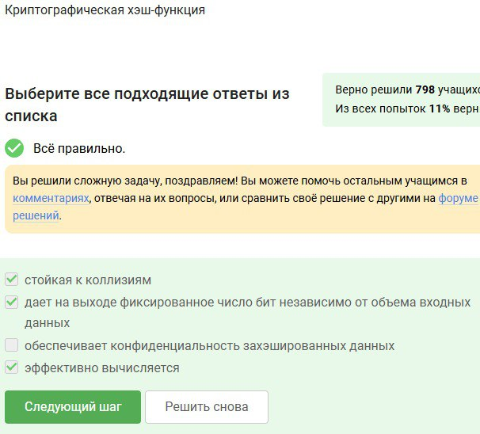
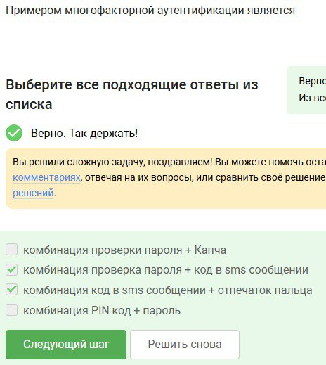

---
## Front matter
title: "Отчет по третьему этапу внешнего курса"
subtitle: "Дисциплина: основы информационнной безопасности"
author: "Казазаев Даниил Михайлович"

## Generic otions
lang: ru-RU
toc-title: "Содержание"

## Bibliography
bibliography: bib/cite.bib
csl: pandoc/csl/gost-r-7-0-5-2008-numeric.csl

## Pdf output format
toc: true # Table of contents
toc-depth: 2
lof: true # List of figures
lot: false # List of tables
fontsize: 12pt
linestretch: 1.5
papersize: a4
documentclass: scrreprt
## I18n polyglossia
polyglossia-lang:
  name: russian
  options:
	- spelling=modern
	- babelshorthands=true
polyglossia-otherlangs:
  name: english
## I18n babel
babel-lang: russian
babel-otherlangs: english
## Fonts
mainfont: PT Serif
romanfont: PT Serif
sansfont: PT Sans
monofont: PT Mono
mainfontoptions: Ligatures=TeX
romanfontoptions: Ligatures=TeX
sansfontoptions: Ligatures=TeX,Scale=MatchLowercase
monofontoptions: Scale=MatchLowercase,Scale=0.9
## Biblatex
biblatex: true
biblio-style: "gost-numeric"
biblatexoptions:
  - parentracker=true
  - backend=biber
  - hyperref=auto
  - language=auto
  - autolang=other*
  - citestyle=gost-numeric
## Pandoc-crossref LaTeX customization
figureTitle: "Рис."
tableTitle: "Таблица"
listingTitle: "Листинг"
lofTitle: "Список иллюстраций"
lotTitle: "Список таблиц"
lolTitle: "Листинги"
## Misc options
indent: true
header-includes:
  - \usepackage{indentfirst}
  - \usepackage{float} # keep figures where there are in the text
  - \floatplacement{figure}{H} # keep figures where there are in the text
---

# Цель работы

Внешний кур состоит из трех этапов.

# Этап первый

Первый этап курса состоит из 4 частей:

1. Введине в криптографию
2. Цифровая подпись
3. Электронные платежи
4. Блокчейн

# Выполнение первого этапа внешнего курса.

## Введине в криптографиюВведине в криптографию

В ассиметричных криптографических примитивах обестороны имеют пару ключей. (рис. [-@fig:001])

{#fig:001 width=70%}

Хещ-функция стойкая к колизиям, дает определенное кол-во бит вне зависимости от объема входных данных и эффективно вычисляется. (рис. [-@fig:002])

{#fig:002 width=70%}

RSA, ECDSA и ГОСТ стандарт(кузнечик) - алгоритмы цифровой подписи. (рис. [-@fig:003])

{#fig:003 width=70%}

Код аунтификации сообщения отеосится к симмитричным примитивам. (рис. [-@fig:004])

{#fig:004 width=70%}

Обмен ключами Диффи-Хэллмана - ассиметрический примитив генерации обзего секретного ключа. (рис. [-@fig:005])

{#fig:005 width=70%}

# Цифровая подпись

Протоколы цифровой подписи с публичным ключом.(рис. [-@fig:006])

{#fig:006 width=70%}

Алгоритм верификации требует на вход: подпись, открытый ключ, сообщение.(рис. [-@fig:007])

{#fig:007 width=70%}

Электронная подпись не обеспечивает конфиденциальность.(рис. [-@fig:008])

{#fig:008 width=70%}

Для отправки налоговой отчетности необходим сертификат с усилненной квалификацией.(рис. [-@fig:009])

{#fig:009 width=70%}

Квалифицированный сертификат можно получить в удостоверяющем центре.(рис. [-@fig:010])

{#fig:010 width=70%}

# Электронные платежи

МИР, MasterCard - платежные системы. (рис. [-@fig:011])

{#fig:011 width=70%}

Отмеченные варианты ответов являются примером многофакторной аутентификации. (рис. [-@fig:012])

{#fig:012 width=70%}

Сегодня при онлайн платежах используется многофакторная аутентификация покупателя перед банком-эмитентом. (рис. [-@fig:013])

{#fig:013 width=70%}

# Блокчейн

В доказательстве работы криптографической хеш-функции используется сложность нахождения прообраза. (рис. [-@fig:014])

{#fig:014 width=70%}

Все ответы являются верными для консенсуса некоторых блокчейн систем. (рис. [-@fig:015])

{#fig:015 width=70%}

Участники криптографического примитива хранят при себе только цифровую подпись. (рис. [-@fig:016])

{#fig:016 width=70%}

# Вывод

Выполнен третий этап внешнего курса
