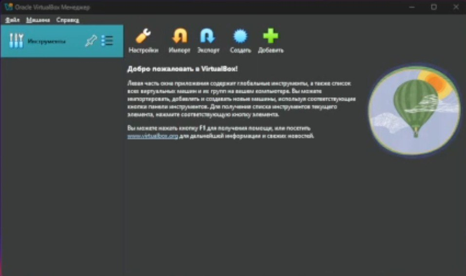

---
## Front matter
lang: ru-RU
title: Лабораторная работа № 1
subtitle: Основы информационной безопасности 
author:
  - Казазаев Д. М.
institute:
  - Российский университет дружбы народов, Москва, Россия

## i18n babel
babel-lang: russian
babel-otherlangs: english

## Formatting pdf
toc: false
toc-title: Содержание
slide_level: 2
aspectratio: 169
section-titles: true
theme: metropolis
header-includes:
 - \metroset{progressbar=frametitle,sectionpage=progressbar,numbering=fraction}
 - '\makeatletter'
 - '\beamer@ignorenonframefalse'
 - '\makeatother'
---

# Информация

## Докладчик

:::::::::::::: {.columns align=center}
::: {.column width="70%"}

  * Казазаев Даниил Михайлович
  * Студент бакалавриата
  * Российский университет дружбы народов
  * [1132231427@rudn.ru]
  * <https://github.com/KazazaevDaniil/study_2024-2025_infosec-intro>

:::
::: {.column width="30%"}

:::
::::::::::::::

# Вводная часть

## Цели и задачи

Целью данной работы является приобретение практических навыков установки операционной системы на виртуальную машину, настройки минимально необходимых для дальнейшей работы сервисов.

## Материалы и методы

Для выполнения лабораторной работы мы воспользуемся виртуальной машиной Oracle VM Virtual Box.
Лабораторные работы выполняется на домашнем оборудовании.

## Содержание исследования

- Этапы работы
 - 1. Установка необходимого ПО и его настройка
 
# Выполнение лабораторной работы.

## Выполнение лабораторной работы.

Для начала откроем наше приложение, в котором у нас будет виртуальная машина. (рис. 1)

{width=70%}

## Выполнение лабораторной работы.

Перехожу к установке. Даю название и образ iso. (рис. 2)

{width=70%}

## Выполнение лабораторной работы.

Устанавливаю имя пользователя и пароль.(рис. 3)

{width=70%}

## Выполнение лабораторной работы.

Устанавливаю значения оборудования виртуальной машины(рис. 4)

{width=70%}

## Выполнение лабораторной работы.

Выделяю необходимый объем памяти ЖД.(рис. 5)

{width=70%}

## Выполнение лабораторной работы.

После всех приготовлений попадаю на главный экран начала установкит нашей ос.(рис. 6)

{width=70%}

## Выполнение лабораторной работы.

Доюавляю память нашей вирутальной ОС.(рис. 7)

{width=70%}

## Выполнение лабораторной работы.

Устанавливаю права администратора.(рис. 8)

{width=70%}

## Выполнение лабораторной работы.

Установка ОС после ее настройки.(рис. 9)

{width=70%}

## Выполнение домашней работы.

Прописав необходимые команды нашел информацию о верисии Линукс, модели иоего ЦП и информацию о гипервизоре.(рис. 10)

{width=70%}

## Выполнение домашней работы.

Чуть поискав информации и попрбовав разные записи, обнаружил, что остальные команды тоже можно выполнить

Ищу частоту процессора, которая составляет 3693 Mhz. (рис. 11)

{width=70%}

## Выполнение домашней работы.

Ищу количество доступной памяти. (рис. 12)

{width=70%}

## Выполнение домашней работы.

Ищу информацию о типе файловой системы. (рис. 13)

{width=70%}

## Выполнение домашней работы.

Последней командой ищу последовательность монтирования файловых систем. (рис. 14)

{width=70%}

# Вывод

В результате выполнения данной лабораторной работы я вспомнил, как устанавливать операционную систему на виртуальную машину

## Результаты

- В ходе выполенения мы вспомнили, как устанавливать ОС на виртуальную машину

