---
## Front matter
title: "Отчет по лабораторной работе № 1"
subtitle: "Дисциплина: основы информационнной безопасности"
author: "Казазаев Даниил Михайлович"

## Generic otions
lang: ru-RU
toc-title: "Содержание"

## Bibliography
bibliography: bib/cite.bib
csl: pandoc/csl/gost-r-7-0-5-2008-numeric.csl

## Pdf output format
toc: true # Table of contents
toc-depth: 2
lof: true # List of figures
lot: false # List of tables
fontsize: 12pt
linestretch: 1.5
papersize: a4
documentclass: scrreprt
## I18n polyglossia
polyglossia-lang:
  name: russian
  options:
	- spelling=modern
	- babelshorthands=true
polyglossia-otherlangs:
  name: english
## I18n babel
babel-lang: russian
babel-otherlangs: english
## Fonts
mainfont: PT Serif
romanfont: PT Serif
sansfont: PT Sans
monofont: PT Mono
mainfontoptions: Ligatures=TeX
romanfontoptions: Ligatures=TeX
sansfontoptions: Ligatures=TeX,Scale=MatchLowercase
monofontoptions: Scale=MatchLowercase,Scale=0.9
## Biblatex
biblatex: true
biblio-style: "gost-numeric"
biblatexoptions:
  - parentracker=true
  - backend=biber
  - hyperref=auto
  - language=auto
  - autolang=other*
  - citestyle=gost-numeric
## Pandoc-crossref LaTeX customization
figureTitle: "Рис."
tableTitle: "Таблица"
listingTitle: "Листинг"
lofTitle: "Список иллюстраций"
lotTitle: "Список таблиц"
lolTitle: "Листинги"
## Misc options
indent: true
header-includes:
  - \usepackage{indentfirst}
  - \usepackage{float} # keep figures where there are in the text
  - \floatplacement{figure}{H} # keep figures where there are in the text
---

# Цель работы

Повторение практических навыйков по установке операционной системы на виртуальную машину

# Задание

1. Установка необходимого ПО.
2. Настройка ПО.

# Задание домашней работы

1. Получить необходимую информацию с помощью команды ```dmesg | grep -i «...»

# Выполнение лабораторной работы.

## Установка дистрибутива 

Для начала откроем наше приложение, в котором у нас будет виртуальная машина. (рис. [-@fig:001])

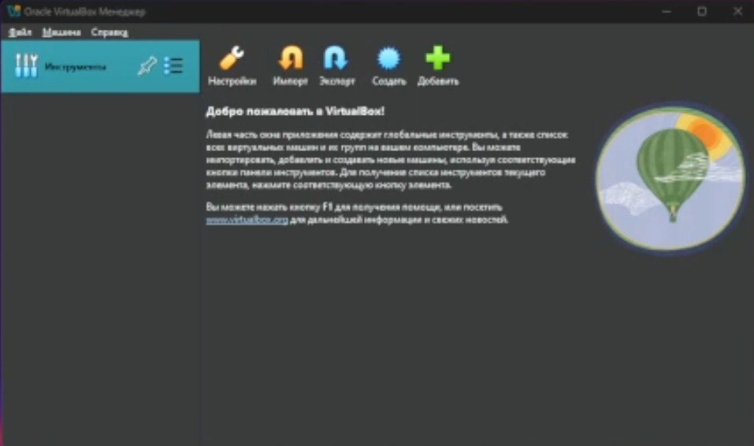{#fig:001 width=70%}

Перехожу к установке. Даю название и образ iso. (рис. [-@fig:002])

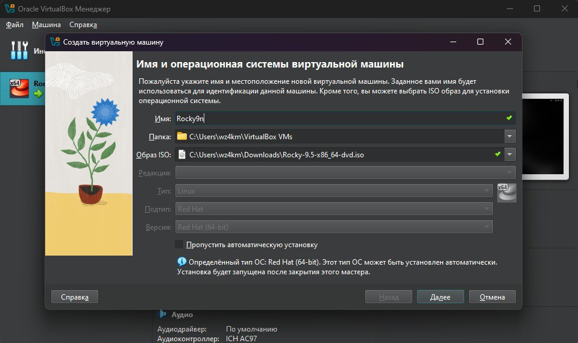{#fig:002 width=70%}

Устанавливаю имя пользователя и пароль.(рис. [-@fig:003])

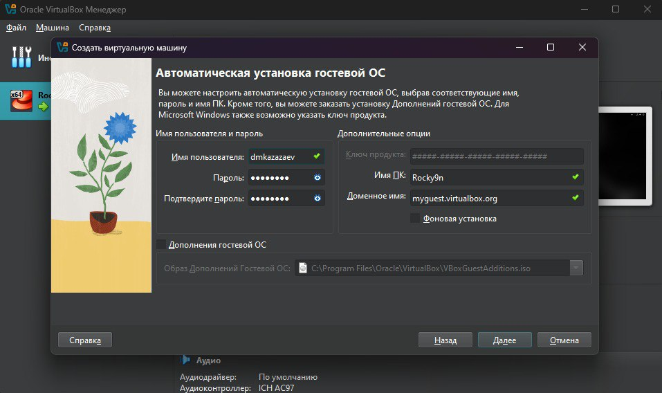{#fig:003 width=70%}

Устанавливаю значения оборудования виртуальной машины(рис. [-@fig:004])

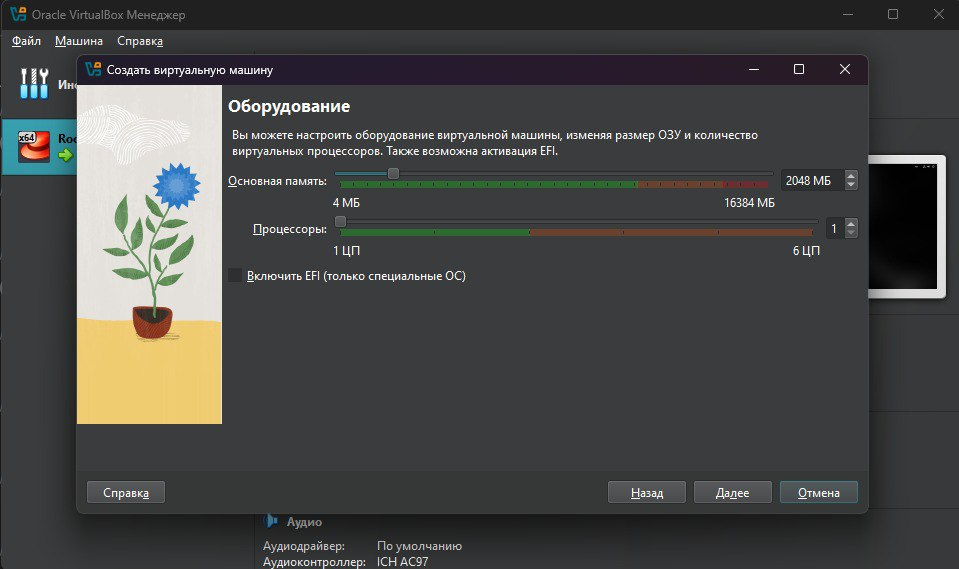{#fig:004 width=70%}

Выделяю необходимый объем памяти ЖД.(рис. [-@fig:005])

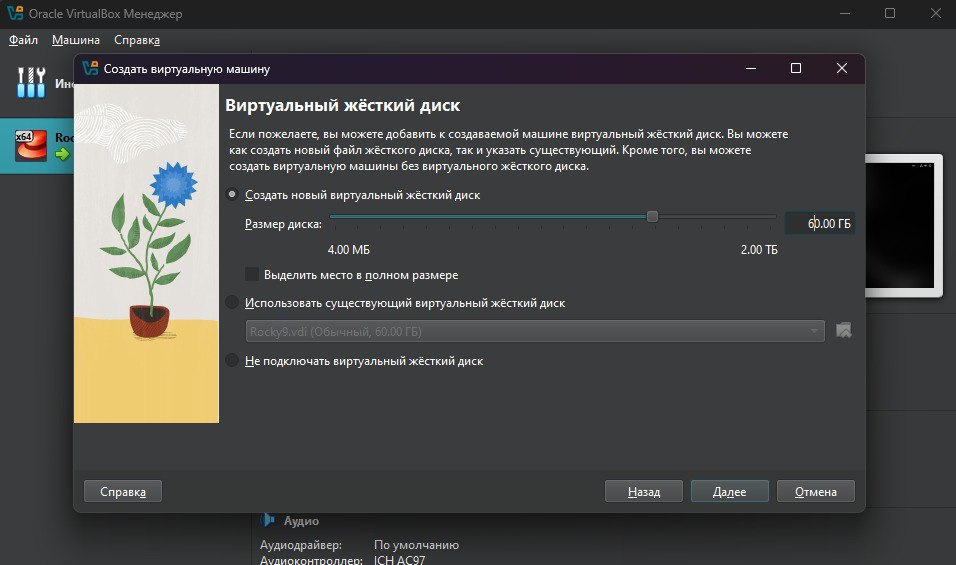{#fig:005 width=70%}

После всех приготовлений попадаю на главный экран начала установкит нашей ос.(рис. [-@fig:006])

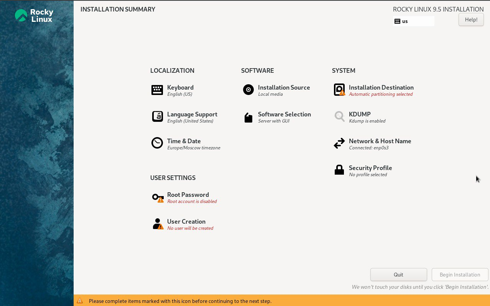{#fig:006 width=70%}

Доюавляю память нашей вирутальной ОС.(рис. [-@fig:007])

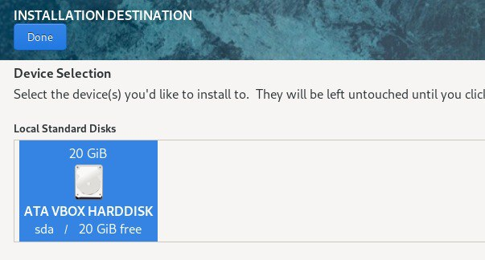{#fig:007 width=70%}

Уставливаю права администратора.(рис. [-@fig:008])

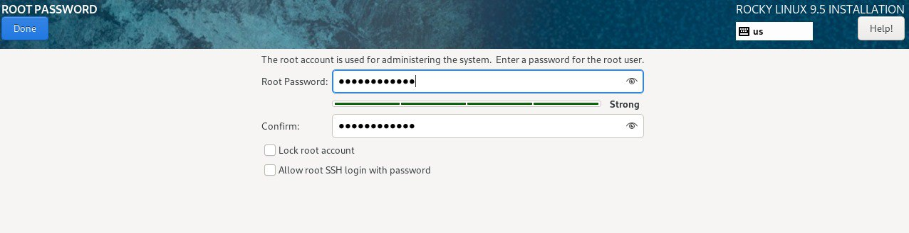{#fig:008 width=70%}

Установка ОС после ее настройки.(рис. [-@fig:009])

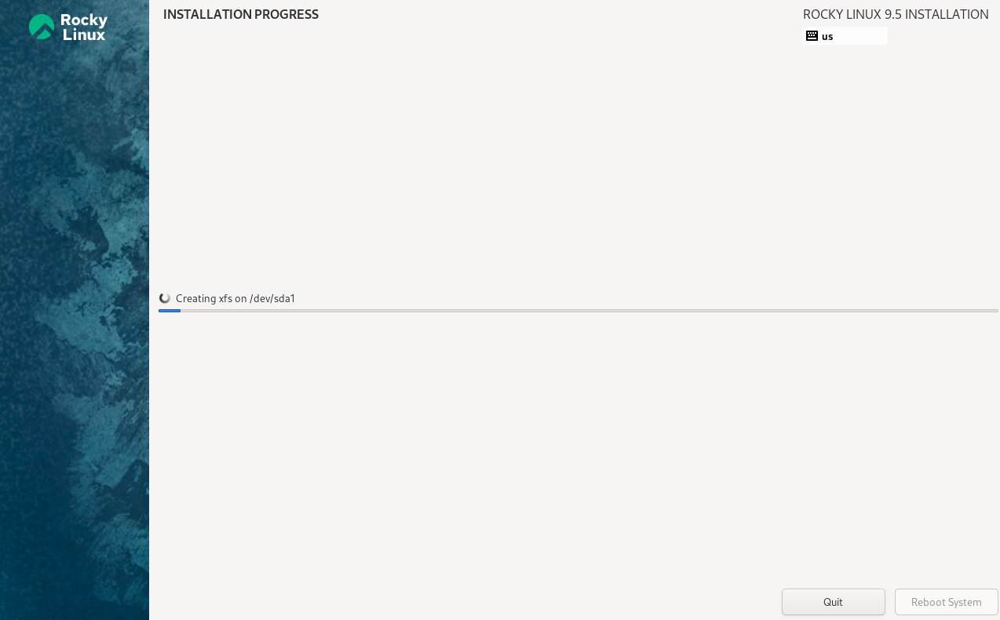{#fig:009 width=70%}


## Выполнение домашней работы.

Прописав необходимые команды нашел информацию о верисии Линукс, модели иоего ЦП и информацию о гипервизоре.(рис. [-@fig:010])

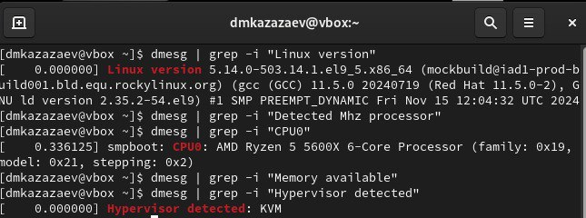{#fig:010 width=70%}

Чуть поискав информации и попрбовав разные записи, обнаружил, что остальные команды тоже можно выполнить

Ищу частоту процессора, которая составляет 3693 Mhz. (рис. [-@fig:011])

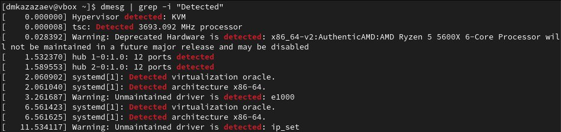{#fig:011 width=70%}

Ищу количество доступной памяти. (рис. [-@fig:012])

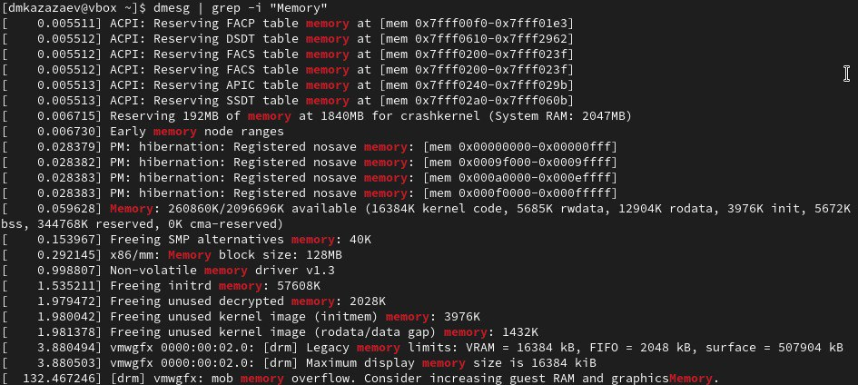{#fig:012 width=70%}

Ищу информацию о типе файловой системы. (рис. [-@fig:013])

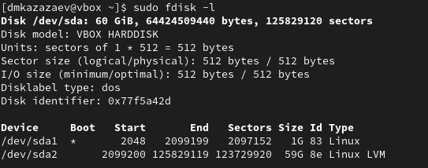{#fig:013 width=70%}

Последней командой ищу последовательность монтирования файловых систем. (рис. [-@fig:014])

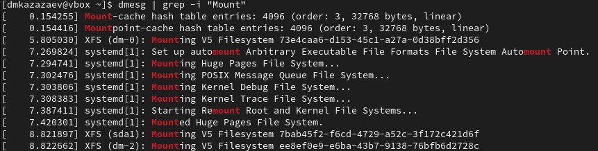{#fig:014 width=70%}

# Вывод

В результате выполнения данной лабораторной работы я вспомнил, как устанавливать операционную систему на виртуальную машину
