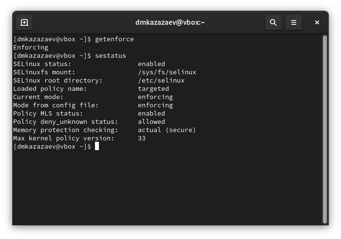

---
## Front matter
lang: ru-RU
title: Лабораторная работа № 6
subtitle: Основы информационной безопасности 
author:
  - Казазаев Д. М.
institute:
  - Российский университет дружбы народов, Москва, Россия

## i18n babel
babel-lang: russian
babel-otherlangs: english

## Formatting pdf
toc: false
toc-title: Содержание
slide_level: 2
aspectratio: 169
section-titles: true
theme: metropolis
header-includes:
 - \metroset{progressbar=frametitle,sectionpage=progressbar,numbering=fraction}
 - '\makeatletter'
 - '\beamer@ignorenonframefalse'
 - '\makeatother'
---

# Информация

## Докладчик

:::::::::::::: {.columns align=center}
::: {.column width="70%"}

  * Казазаев Даниил Михайлович
  * Студент бакалавриата
  * Российский университет дружбы народов
  * [1132231427@rudn.ru]
  * <https://github.com/KazazaevDaniil/study_2024-2025_infosec-intro>

:::
::: {.column width="30%"}


:::
::::::::::::::

# Вводная часть

## Цели и задачи

Развитие навыков администрирования ОС Linux. Получение практических навыков в работе с технологией SELinux. Проверка работы SELinux совестно с Apache.

## Материалы и методы

Для выполнения лабораторной работы мы воспользуемся виртуальной машиной Oracle VM Virtual Box.
Лабораторные работы выполняется на домашнем оборудовании.


## Содержание исследования

- Этапы работы
 - 1. Выполнение лабораторной работы.
 
# Выполнение лабораторной работы.

## Выполнение лабораторной работы.

После запуска проверяю, работает-ли SELinux. (рис. 1)

{width=70%}

## Выполнение лабораторной работы.

Проверяю запущен-ли Apache. Так как он не запущен, запускаю его. (рис. 2)

{width=70%}

## Выполнение лабораторной работы.

Смотрю контекст безопасности веб-сервера Apache.(рис. 3)

{width=70%}

## Выполнение лабораторной работы.

{width=70%}

## Выполнение лабораторной работы.

Смотрю состояние переключаетелей SELinux.(рис. 5)

{width=70%}

## Выполнение лабораторной работы.

Смотрю статистику по политеке SELinux.(рис. 6)

{width=70%}

## Выполнение лабораторной работы.

Смотрю, какие типы файлов есть в директории /var/www и права доступа к этим файлам.(рис. 7)

{width=70%}

## Выполнение лабораторной работы.

Создаю html файл в /var/www/html.(рис. 8)

{width=70%}

## Выполнение лабораторной работы.

Переношу простую программу в созданный файл.(рис. 9)

{width=70%}

## Выполнение лабораторной работы.

Проверяю контекст нового файла.(рис. 10)

{width=70%}

## Выполнение лабораторной работы.

По умолчанию присваевается контекст вида ```unconfident_u:object_r:httpd_sys_content_t:s0```

## Выполнение лабораторной работы.

Запускаю тестовый файл в веб-сервисе. (рис. 11)

{width=70%}

## Выполнение лабораторной работы.

Изучаю, какие контексты могут быть присвоеный файлам. (рис. 12)

{width=70%}

## Выполнение лабораторной работы.

Детальнее изучаю контекст созданного файла. (рис. 13)

{width=70%}

## Выполнение лабораторной работы.

Меняю контекст файла на ```samba_share_t```. (рис. 14)

{width=70%}

## Выполнение лабораторной работы.

После сменя контекста перезапускаю веб-сервис. При попытке запуска файла выводится ошибка прав доступа. (рис. 15)

{width=70%}

## Выполнение лабораторной работы.

Недостаток доступа обусловлен тем, что новый контестк непубличный.

## Выполнение лабораторной работы.

Проверяю права доступа html файла. (рис. 16)

{width=70%}

## Выполнение лабораторной работы.

В конфиг файле Apache меняю прослушивание TCP-порта на 81. (рис. 17)

{width=70%}

## Выполнение лабораторной работы.

Добавляю новый TCP-порт. (рис. 18)

{width=70%}

## Выполнение лабораторной работы.

После добавление 81-го порта сайт должен был запуститься, но у меня этого не произошло.

## Выполнение лабораторной работы.

Удаляю новый порт. (рис. 19)

{width=70%}

## Выполнение лабораторной работы.

Удаляю созданный в ходе лабораторной работы html файл. (рис. 20)

{width=70%}

# Вывод

В ходе лабораторной работы я познакомился с администрированием ОС Linux. Полученил практические навыкы в работе с технологией SELinux. Проверил работу SELinux совестно с Apache.

