---
## Front matter
title: "Отчет по лабораторной работе № 6"
subtitle: "Дисциплина: основы информационнной безопасности"
author: "Казазаев Даниил Михайлович"

## Generic otions
lang: ru-RU
toc-title: "Содержание"

## Bibliography
bibliography: bib/cite.bib
csl: pandoc/csl/gost-r-7-0-5-2008-numeric.csl

## Pdf output format
toc: true # Table of contents
toc-depth: 2
lof: true # List of figures
lot: false # List of tables
fontsize: 12pt
linestretch: 1.5
papersize: a4
documentclass: scrreprt
## I18n polyglossia
polyglossia-lang:
  name: russian
  options:
	- spelling=modern
	- babelshorthands=true
polyglossia-otherlangs:
  name: english
## I18n babel
babel-lang: russian
babel-otherlangs: english
## Fonts
mainfont: PT Serif
romanfont: PT Serif
sansfont: PT Sans
monofont: PT Mono
mainfontoptions: Ligatures=TeX
romanfontoptions: Ligatures=TeX
sansfontoptions: Ligatures=TeX,Scale=MatchLowercase
monofontoptions: Scale=MatchLowercase,Scale=0.9
## Biblatex
biblatex: true
biblio-style: "gost-numeric"
biblatexoptions:
  - parentracker=true
  - backend=biber
  - hyperref=auto
  - language=auto
  - autolang=other*
  - citestyle=gost-numeric
## Pandoc-crossref LaTeX customization
figureTitle: "Рис."
tableTitle: "Таблица"
listingTitle: "Листинг"
lofTitle: "Список иллюстраций"
lotTitle: "Список таблиц"
lolTitle: "Листинги"
## Misc options
indent: true
header-includes:
  - \usepackage{indentfirst}
  - \usepackage{float} # keep figures where there are in the text
  - \floatplacement{figure}{H} # keep figures where there are in the text
---

# Цель работы

Развитие навыков администрирования ОС Linux. Получение практических навыков в работе с технологией SELinux. Проверка работы SELinux совестно с Apache.

# Выполнение лабораторной работы.

После запуска проверяю, работает-ли SELinux. (рис. [-@fig:001])

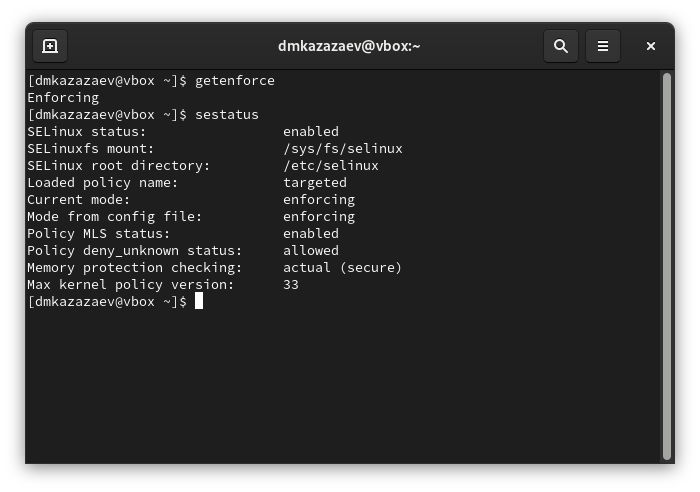{#fig:001 width=70%}

Проверяю запущен-ли Apache. Так как он не запущен, запускаю его. (рис. [-@fig:002])

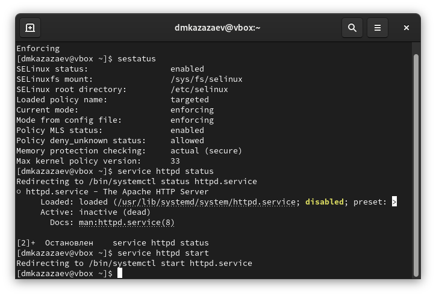{#fig:002 width=70%}

Смотрю контекст безопасности веб-сервера Apache.(рис. [-@fig:003])

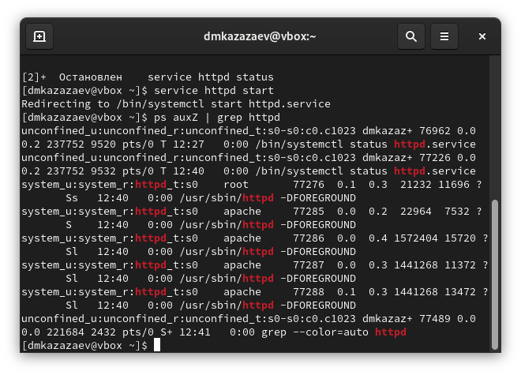{#fig:003 width=70%}

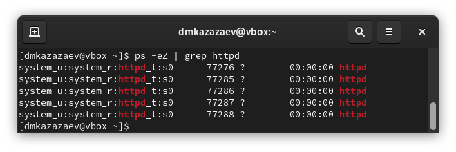{#fig:004 width=70%}

Смотрю состояние переключаетелей SELinux.(рис. [-@fig:005])

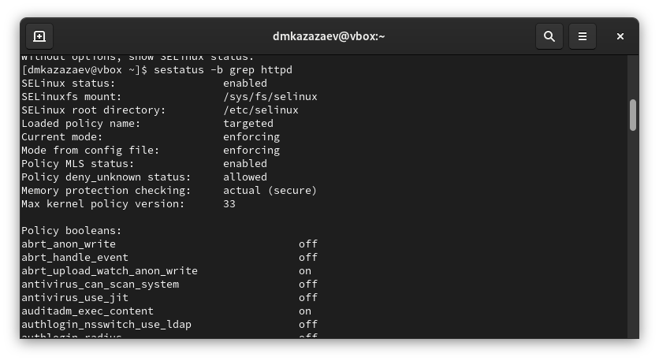{#fig:005 width=70%}

Смотрю статистику по политеке SELinux.(рис. [-@fig:006])

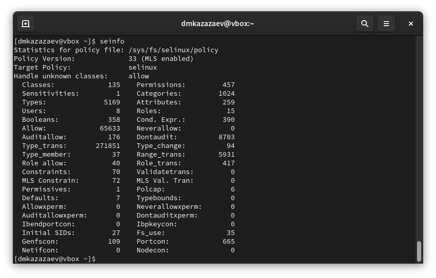{#fig:006 width=70%}

Смотрю, какие типы файлов есть в директории /var/www и права доступа к этим файлам.(рис. [-@fig:007])

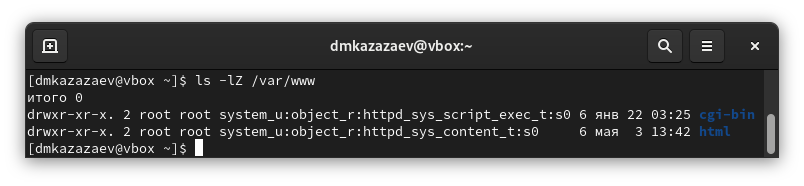{#fig:007 width=70%}

Создаю html файл в /var/www/html.(рис. [-@fig:008])

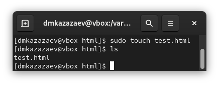{#fig:008 width=70%}

Переношу простую программу в созданный файл.(рис. [-@fig:009])

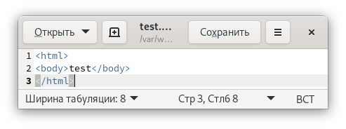{#fig:009 width=70%}

Проверяю контекст нового файла.(рис. [-@fig:010])

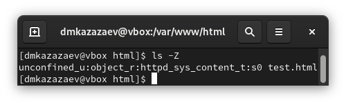{#fig:010 width=70%}

По умолчанию присваевается контекст вида ```unconfident_u:object_r:httpd_sys_content_t:s0```

Запускаю тестовый файл в веб-сервисе. (рис. [-@fig:011])

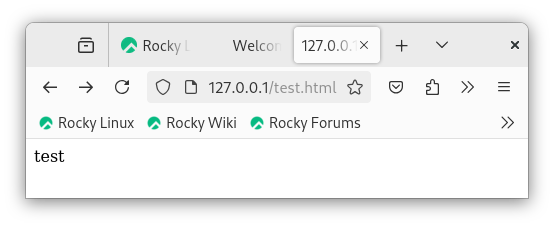{#fig:011 width=70%}

Изучаю, какие контексты могут быть присвоеный файлам. (рис. [-@fig:012])

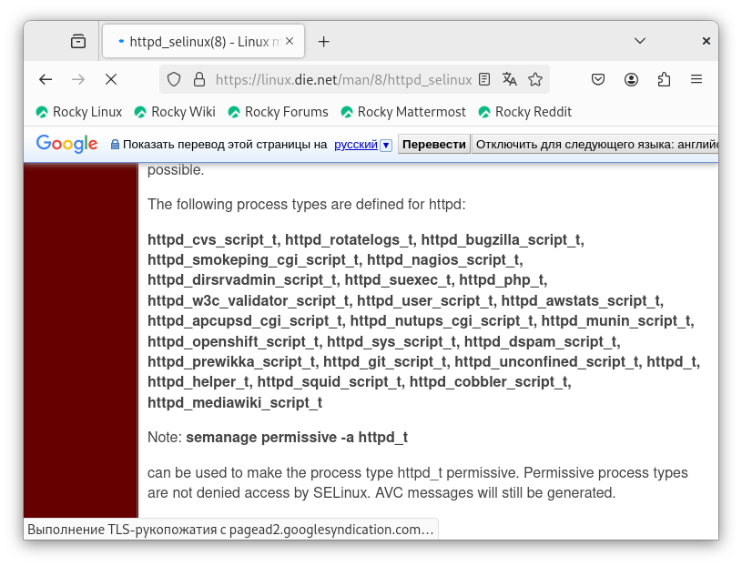{#fig:012 width=70%}

Детальнее изучаю контекст созданного файла. (рис. [-@fig:013])

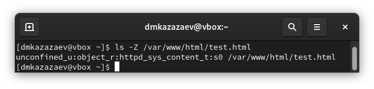{#fig:013 width=70%}

Меняю контекст файла на ```samba_share_t```. (рис. [-@fig:014])

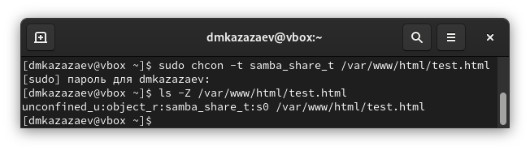{#fig:014 width=70%}

После сменя контекста перезапускаю веб-сервис. При попытке запуска файла выводится ошибка прав доступа. (рис. [-@fig:015])

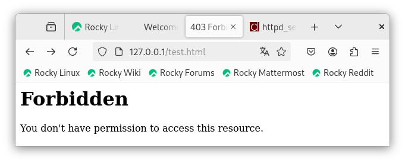{#fig:015 width=70%}

Недостаток доступа обусловлен тем, что новый контестк непубличный.

Проверяю права доступа html файла. (рис. [-@fig:016])

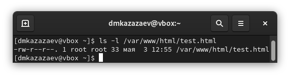{#fig:016 width=70%}

В конфиг файле Apache меняю прослушивание TCP-порта на 81. (рис. [-@fig:017])

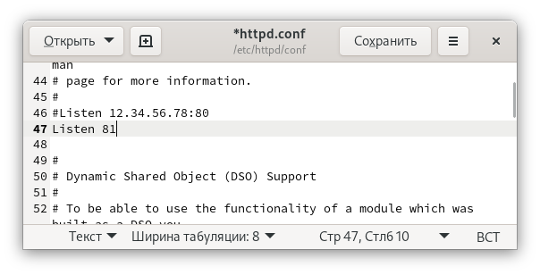{#fig:017 width=70%}

Добавляю новый TCP-порт. (рис. [-@fig:018])

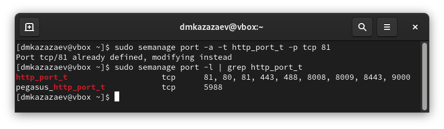{#fig:018 width=70%}

После добавление 81-го порта сайт должен был запуститься, но у меня этого не произошло.

Удаляю новый порт. (рис. [-@fig:019])

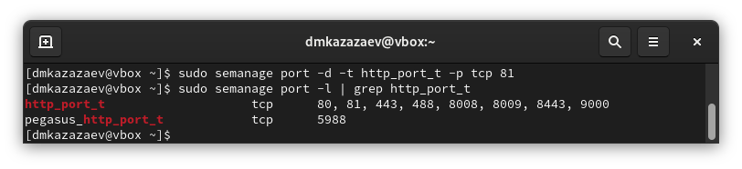{#fig:019 width=70%}

Удаляю созданный в ходе лабораторной работы html файл. (рис. [-@fig:020])

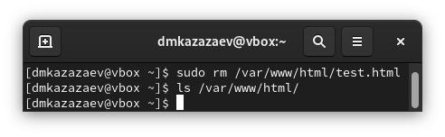{#fig:020 width=70%}

# Вывод

В ходе лабораторной работы я познакомился с администрированием ОС Linux. Полученил практические навыкы в работе с технологией SELinux. Проверил работу SELinux совестно с Apache.
