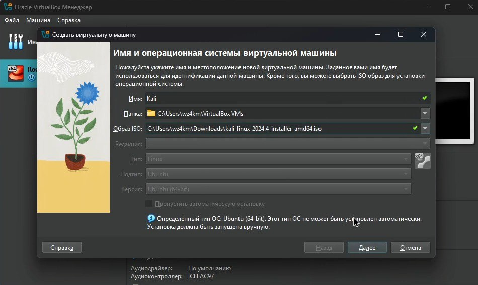
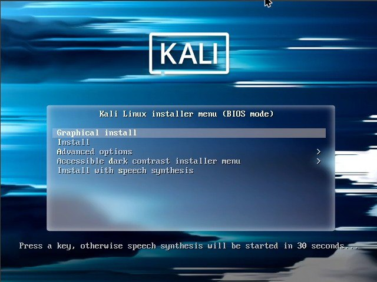
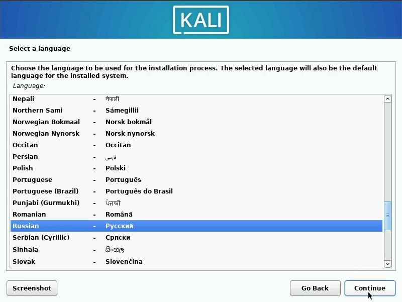
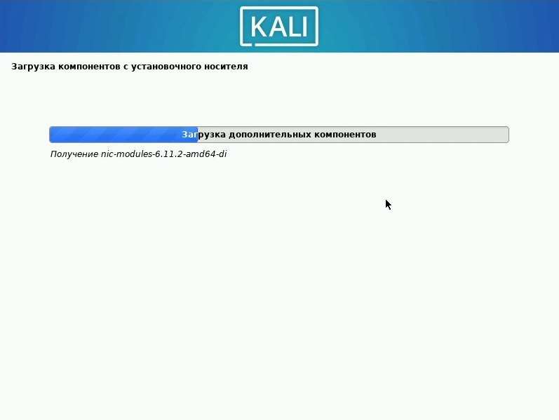
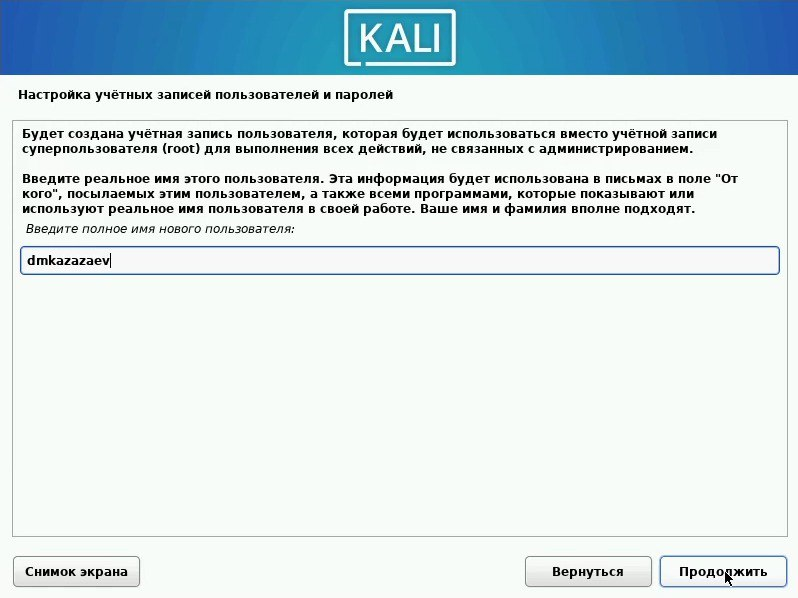
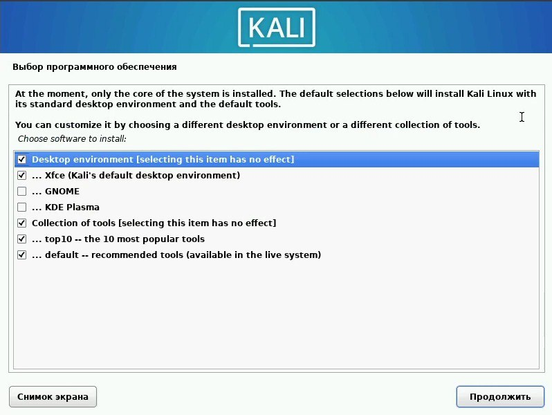
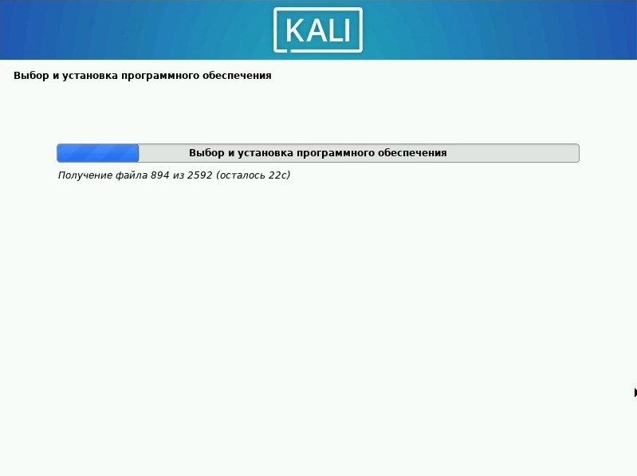
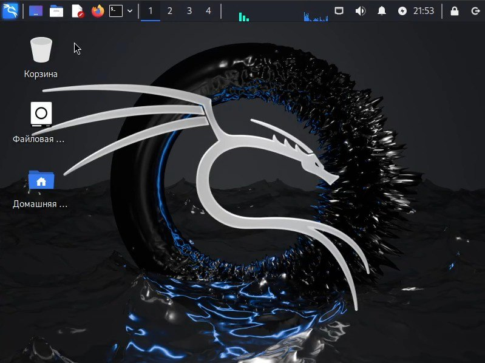

---
## Front matter
lang: ru-RU
title: Инидивидуальный проект. Этап 1
subtitle: Основы информационной безопасности 
author:
  - Казазаев Д. М.
institute:
  - Российский университет дружбы народов, Москва, Россия

## i18n babel
babel-lang: russian
babel-otherlangs: english

## Formatting pdf
toc: false
toc-title: Содержание
slide_level: 2
aspectratio: 169
section-titles: true
theme: metropolis
header-includes:
 - \metroset{progressbar=frametitle,sectionpage=progressbar,numbering=fraction}
 - '\makeatletter'
 - '\beamer@ignorenonframefalse'
 - '\makeatother'
---

# Информация

## Докладчик

:::::::::::::: {.columns align=center}
::: {.column width="70%"}

  * Казазаев Даниил Михайлович
  * Студент бакалавриата
  * Российский университет дружбы народов
  * [1132231427@rudn.ru]
  * <https://github.com/KazazaevDaniil>

:::
::: {.column width="30%"}

:::
::::::::::::::

# Вводная часть

## Цели и задачи

Установка ОС Kali Linux

## Материалы и методы

Для выполнения лабораторной работы мы воспользуемся виртуальной машиной Oracle VM Virtual Box.
Индивидуальный проект выполняется на домашнем оборудовании.

## Содержание 

- Этапы работы
 - 1. Установка ОС Kali Linux
 
# Выполнение индивидуального проекта.

## Выполнение индивидуального проекта.

оздаю новую виртуальную машину для индивидуального проекта (рис. 1).

{width=70%}

## Выполнение индивидуального проекта.

После запуска начинаю установку ОС  (рис. 2).

{width=70%}

## Выполнение индивидуального проекта.

Выбираю язык ОС (рис. 3).

{width=70%}

## Выполнение индивидуального проекта.

Жду окончания загрузки (рис. 4).

{width=70%}

## Выполнение индивидуального проекта.

Настраиваю пользователя (рис. 5).

{width=70%}

## Выполнение индивидуального проекта.

Вибираю программное обеспечение (рис. 6).

{width=70%}

## Выполнение индивидуального проекта.

Жду окончания еще одной загрузки (рис. 7).

{width=70%}

## Выполнение индивидуального проекта.

После загрузки перезагрузил систему и зашел в созданного мной пользователя (рис. 8).

{width=70%}

# Выводы

При выполнении этого этапа индивидуального проекта мы установили ОС Kali Linux.

